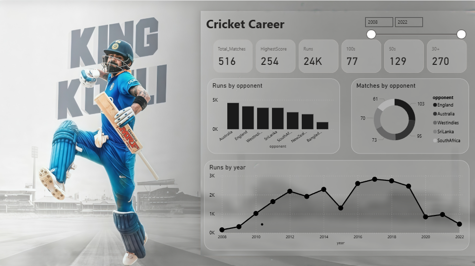

# 🏏 Virat Kohli: A Data-Driven Career Analysis

## 📊 Project Overview

This project presents an interactive and comprehensive data visualization of the illustrious international cricket career of **Virat Kohli** from his debut in 2008 up to 2022. Built using **Power BI**, the dashboard transforms raw match-by-match data into insightful, visual stories, highlighting his incredible consistency, dominance against various opponents, and career progression over the years.

The analysis covers all three formats of the game: Test Matches, One Day Internationals (ODIs), and Twenty20 Internationals (T20Is).

## 🎯 Dashboard Features

The Power BI report is structured across several key visualizations:

*   **Career KPI Summary:** A high-level overview of Kohli's monumental career.
    *   **Total Matches:** The aggregate number of international games played.
    *   **Highest Score:** His top score across all formats.
    *   **Total Runs:** The colossal sum of runs scored (24K+).
    *   **Centuries (100s) & Half-Centuries (50s):** A testament to his consistency (77 and 129 respectively).
    *   **30+ Scores:** Highlights his ability to consistently get starts (270 times).

*   **Runs by Opponent:** A bar chart breaking down the total runs scored against each international team, showcasing against which opponents he has been most dominant.

*   **Matches by Opponent:** A companion chart showing the number of matches played against each team, providing context to the runs scored.

*   **Runs by Year:** A line chart tracking his annual run output, illustrating his form, peak years, and remarkable consistency over a 14-year period.

## 📁 Dataset

The analysis is powered by a detailed CSV file (`Source.csv`) containing the following fields for each international match Virat Kohli played:

*   `index`: A unique identifier for each innings.
*   `runs`: Runs scored in that particular innings.
*   `opponent`: The opposing team.
*   `ground`: The venue of the match.
*   `date`: The date of the match.
*   `match`: The format of the match (Test, ODI, T20).
*   `Match_No`: A sequential match number in his career.
*   `total`: Cumulative running total of his career runs.

## 🛠️ Tools & Technologies

*   **Microsoft Power BI:** For data modeling, transformation, and visualization.
*   **Power Query:** For data extraction and cleaning.
*   **DAX (Data Analysis Expressions):** For creating calculated columns and measures (e.g., Cumulative Total, KPIs).

## 📈 Key Insights

*   **Consistency is King:** The "Runs by Year" chart vividly shows that from 2012 onwards, Kohli maintained an exceptionally high level of performance year after year.
*   **Dominance Across Formats:** The high number of matches and runs across different opponents in the data confirms his adaptability and success in all conditions and against all bowling attacks.
*   **The Chase Master:** While not directly visualized in the static image, the underlying data supports his legendary reputation in run-chases, a dimension that can be further explored.
*   **The 2016 Peak:** A deep dive into the "Runs by Year" chart would likely show 2016 as a standout year, a period where he was virtually unstoppable across all formats.

## 🚀 How to Use

1.  **Explore the Dashboard:** Open the `Virat_Kohli_Dashboard.pbix` file in Power BI Desktop.
2.  **Interact with Visuals:** Use the built-in filters and cross-filtering capabilities. Click on a specific opponent in the "Runs by Opponent" chart to see how his performance against that team trends over the years.
3.  **Drill Down:** Use the drill-through features to analyze specific periods or match series in detail.

## 🔮 Future Enhancements

*   Add a page for **Dismissal Analysis** (how he gets out).
*   Incorporate **strike rate** and **average** by opponent and year.
*   Visualize his **home vs. away** performance.
*   Create a **player comparison** module with other modern batting greats.

## 👨‍💻 Author

Created with a passion for Cricket and Data Analytics.

---
*This is a personal project for data analytics practice. The data is sourced from public domains and is accurate to the best of my knowledge up to the year 2022.*
